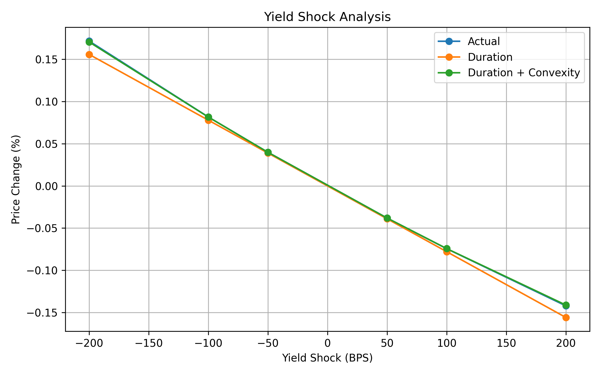

# Bond Pricer

A Python based fixed-income bond pricing and risk analytics engine. The project implements bond valuation from first principles and calculates duration, convexity, yield sensitivity, and yield-shock approximations. QuantLib is used as an external benchmark for model validation.

## Overview

The engine calculates:

* Bond cash flows
* Discount factors
* Present value and bond price
* Macaulay duration
* Modified duration
* Convexity
* Yield sensitivity
* Duration and convexity-based yield-shock approximations

The core pricing and risk calculations are implemented independently using Python and pandas, with QuantLib used separately for validation.

---

## Bond Pricing

The bond price is calculated as the present value of all future cash flows:

$$
P = \sum_{t=1}^{n}\frac{CF_t}{(1+y/m)^t}
$$

where:

* (P) = bond price
* (CF_t) = cash flow in period (t)
* (y) = annual yield to maturity
* (m) = compounding frequency
* (t) = coupon period

### Example Bond

| Parameter        |      Value |
| ---------------- | ---------: |
| Face Value       |        100 |
| Coupon Rate      |         5% |
| Maturity         |   10 years |
| Coupon Frequency | Semiannual |
| Coupon Payment   |       2.50 |

The model generates a valuation table containing the cash flow, discount factor, and present value for each coupon period.

At a 5% YTM, the bond is priced at par:

**Price = 100.00**

The model also demonstrates the inverse relationship between bond prices and yields:

| YTM |  Price |
| --: | -----: |
|  3% | 117.17 |
|  5% | 100.00 |
|  7% |  85.79 |

---

## Duration and Convexity

The model calculates macaulay duration, modified duration, and convexity to measure the bond's sensitivity to changes in interest rates.

For the example bond:

| Measure           |      Value |
| ----------------- | ---------: |
| Macaulay Duration | 7.99 years |
| Modified Duration |       7.79 |
| Convexity         |      73.63 |

Duration provides a first-order approximation of the price impact from a change in yield, while convexity captures the second-order curvature of the price-yield relationship.

---

## Yield Sensitivity

The model calculates the bond price across a range of yields.


| YTM |  Price |
| --: | -----: |
|  2% | 127.07 |
|  3% | 117.17 |
|  4% | 108.18 |
|  5% | 100.00 |
|  6% |  92.56 |
|  7% |  85.79 |
|  8% |  79.61 |

The results demonstrate the inverse relationship between bond prices and yields, as well as the convex shape of the price yield relationship.

---

## Yield Shock Analysis

The model compares the actual price change following a yield shock with approximations based on duration alone and duration plus convexity.



| Yield Shock |  Actual | Duration | Duration + Convexity |
| ----------: | ------: | -------: | -------------------: |
|    -200 bps | +17.17% |  +15.59% |              +17.06% |
|    -100 bps |  +8.18% |   +7.79% |               +8.16% |
|     -50 bps |  +3.99% |   +3.90% |               +3.99% |
|     +50 bps |  -3.81% |   -3.90% |               -3.81% |
|    +100 bps |  -7.44% |   -7.79% |               -7.43% |
|    +200 bps | -14.21% |  -15.59% |              -14.12% |

The analysis demonstrates that duration alone becomes increasingly inaccurate for larger yield shocks. Incorporating convexity materially improves the approximation, particularly for larger changes in yield and non-parallel shifts in the yield curve. 

---

## Model Validation

The custom pricing engine was benchmarked against QuantLib using the same 10-year, 5% coupon bond with semiannual payments.

### Bond Price Comparison

| YTM | Custom Model | QuantLib | Difference |
| --: | -----------: | -------: | ---------: |
|  3% |       117.17 |   117.18 |       0.01 |
|  5% |       100.00 |   100.00 |       0.00 |
|  7% |        85.79 |    85.78 |       0.01 |

The negligible pricing differences validate the implementation of the custom discounted cash-flow pricing engine.

### Risk Measure Comparison

| Metric            | Custom Model | QuantLib |
| ----------------- | -----------: | -------: |
| Macaulay Duration |         7.99 |     7.80 |
| Modified Duration |         7.79 |     7.54 |
| Convexity         |        73.63 |    70.04 |

The differences in duration and convexity are attributable to differences in valuation conventions. The custom model treats the bond as being valued exactly at a coupon date using equal semiannual periods, while QuantLib incorporates an explicit bond schedule, settlement date, calendar, and day-count convention.

Rather than forcing the custom implementation to reproduce QuantLib's output, the comparison highlights how bond timing conventions can affect fixed-income risk measures while demonstrating that the underlying pricing engine produces effectively identical bond prices.

---

## Project Structure

```text
Bond-Pricer/
├── src/
│   ├── bond.py
│   ├── pricing.py
│   ├── visualization.py
│   ├── main.py
│   └── quantlib_validation.py
├── figures/
│   ├── yield_sensitivity.png
│   └── yield_shock_analysis.png
├── README.md
├── requirements.txt
└── .gitignore
```

---

## Technologies

* Python
* pandas
* Matplotlib
* QuantLib

---

## Running the Project

Install the required dependencies:

pip install -r requirements.txt

Run the custom pricing and analytics engine:

python3 -m src.main

Run the QuantLib validation:

python3 -m src.quantlib_validation