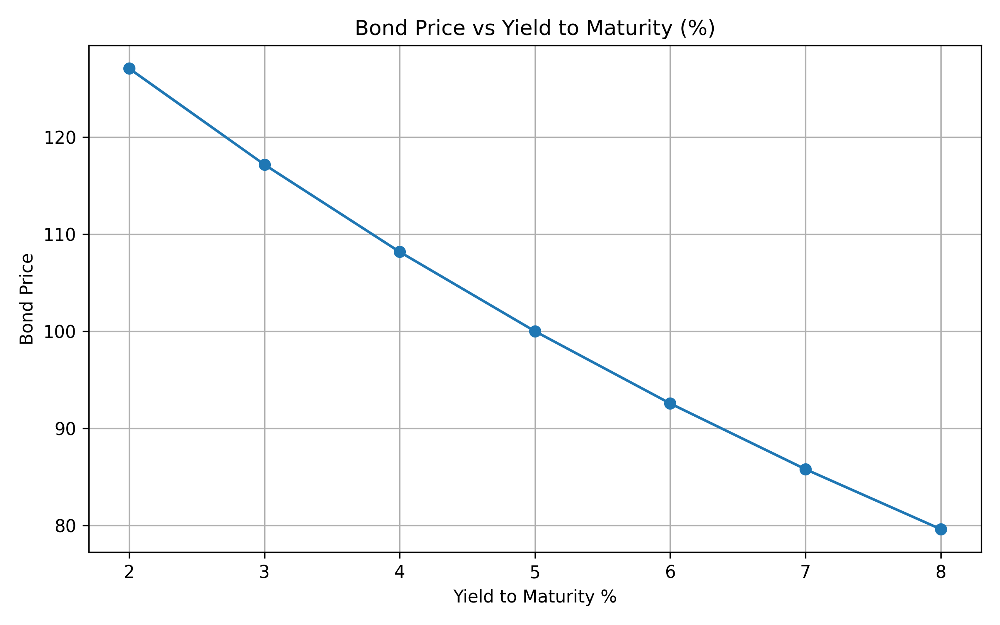

# Bond-Pricer
A pricing engine for Fixed-Income securities with advanced analysis for measuring interest-rate risk. The project utilizes bond valuation and risk measures to compare against the benchmark engine which is QuantLib. 

# Overview
The engine is capable of the following calculations: 

Bond Cash Flows
Discount Factors 
Present value and bond price 
Macaulay duration 
Modified duration 
Convexity 
Yield sensitivity
Duration and convexity yield shock approximations 

the core pricing and risk measures are calculated using python and pandas with QuantLib as verification 

# Bond Analytics
Calculated as the present value of all future cash flows. 
P = sum (CF(t))/(1+y/m)^t
where: 
P = bond price 
Cf(t) = Cash flow in period t 
y = Annual yield to maturity
m = Compounding frequency 
t = Coupon period 

Example Bond
Parameter	Value
Face Value	100
Coupon Rate	5%
Maturity	10 years
Coupon Frequency	Semiannual
Coupon Payment	2.50

The model generates a valuation table containing the cash flow, discount factor, and present value for each coupon period.

At a 5% YTM, the bond is priced at par:

Price = 100.00

The model also demonstrates the inverse relationship between bond prices and yields:

YTM	Price
3%	117.17
5%	100.00
7%	85.79
Duration and Convexity

The model calculates Macaulay duration, Modified duration, and Convexity to measure the bond's sensitivity to changes in interest rates.

For the example bond:

Measure	Value
Macaulay Duration	7.99 years
Modified Duration	7.79
Convexity	73.63

Duration provides a first-order approximation of the price impact from a change in yield, while convexity captures the second-order curvature of the price yield relationship. In general, duration gets more inaccurate for larger shifts in yield and non-parallel shifts of the yield curve.

Yield Sensitivity

The model calculates the bond price across a range of yields.

YTM	Price
2%	127.07
3%	117.17
4%	108.18
5%	100.00
6%	92.56
7%	85.79
8%	79.61

The relationship demonstrates the inverse relationship between bond prices and yields as well as the convex shape of the price yield relationship.

Visualization: 

Yield Shock Analysis

The model compares the actual price change following a yield shock with approximations based on duration alone and duration plus convexity.
Shock        Actual     Duration     Duration + Convexity      
-200 bps	+17.17%	    +15.59%	            +17.06%
-100 bps	+8.18%	    +7.79%	            +8.16%
-50 bps	    +3.99%	    +3.90%	            +3.99%
+50 bps	    -3.81%	    -3.90%	            -3.81%
+100 bps	-7.44%	    -7.79%	            -7.43%
+200 bps	-14.21%	    -15.59%	            -14.12%

The analysis demonstrates that duration alone becomes increasingly inaccurate for larger yield shocks. Incorporating convexity materially improves the approximation, particularly for larger changes in yield.

Visualization: 

Model Validation

The custom bond pricing engine was benchmarked against QuantLib using the same 10-year, 5% coupon bond with semiannual payments.

Bond Price Comparison
YTM	Custom 	    QuantLib	Difference
3%	117.17	    117.18	    0.01
5%	100.00	    100.00	    0.00
7%	85.79	    85.78	    0.01

The negligible pricing differences validate the implementation of the custom pricing engine.

Risk Measure Comparison
Metric	           Custom 	QuantLib
Macaulay Duration	7.99	7.80
Modified Duration	7.79	7.54
Convexity	        73.63	70.04

The differences in duration and convexity are attributable to differences in valuation conventions. The custom model treats the bond as being valued exactly at a coupon date using equal semiannual periods. Conversely, QuantLib incorporates an explicit schedule, settlement date, calendar, and day count convention.

Rather than forcing the custom implementation to reproduce QuantLib's output, the comparison highlights the discrepencies between bond timing conventions that impact fixed-income risk measures.

# Project Structure
Bond-Pricer/
├── src/
│   ├── bond.py
│   ├── pricing.py
│   ├── main.py
│   └── quantlib_validation.py
|   └── visualization.py    
├── figures/
│   ├── yield_sensitivity.png
│   └── yield_shock_analysis.png
├── README.md
├── requirements.txt
└── .gitignore

# Technologies
Python
pandas
Matplotlib
QuantLib

# Running the Project
Clone the repository and install the required dependencies:
pip install -r requirements.txt
Run the custom pricing engine:
python3 -m src.main
Run the QuantLib validation:
python3 -m src.quantlib_validation